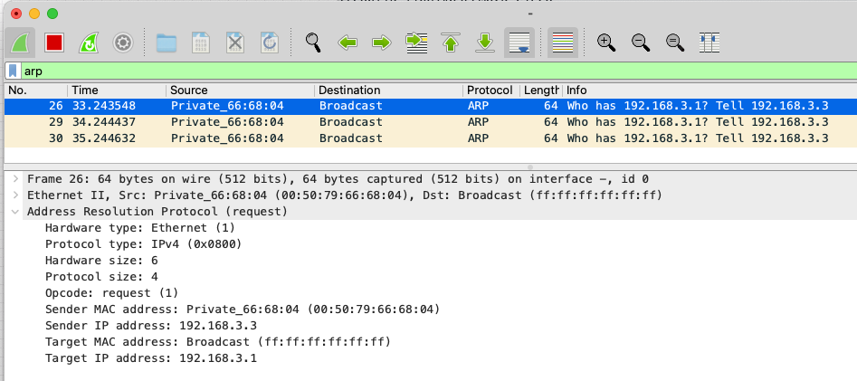

### Configure Router-on-a-Stick Inter-VLAN Routing


### Addressing Table


### VLAN Table


### Objectives
- Part 1: Build the Network and Configure Basic Device Settings
- Part 2: Create VLANs and Assign Switch Ports
- Part 3: Configure an 802.1Q Trunk between the Switches
- Part 4: Configure Inter-VLAN Routing on the Router
- Part 5: Verify Inter-VLAN Routing is working


#### Введение

**Коммутатор (Switch)** - используется для связи конечных **устройств** в локальной сети (LAN)<br> 
**Маршрутизатор (Router)** - используется для связи **подсетей**<br>

**VLAN** (Virtual Local Area Network) — группа устройств, имеющих возможность взаимодействовать между собой напрямую на канальном уровне, 
хотя физически при этом они могут быть подключены к разным сетевым коммутаторам. 

И наоборот, устройства, находящиеся в разных VLAN'ах, невидимы друг для друга на канальном уровне, даже если они подключены к одному коммутатору, и связь между этими устройствами возможна только на сетевом и более высоких уровнях.

Для маршрутизации **между различными VLAN** используют:

- **L3 коммутаторы** (через **SVI** (Switch VLAN Interface) шлюзы)
- схему **Router-on-a-Stick** (роутер на палочке)

#### Router-on-a-Stick

Как работает роутер "на палочке"?

Проблема<br>

Из VLAN1 нет связи с устройствами VLAN2.

Что это значит?<br>

Все датаграммы из VLAN1 пересылаются (broadcast, unicast) между портами устройств 
из VLAN1, пусть и подключенных к разным свичам. У них нет шанса попасть на подсети из другово VLAN2.
А нам иногда нужно обращаться к устройствам за пределами нашей LAN.

#### Задача <br>

Настроить таблицу маршрутизации между различными VLAN.

#### Основные команды:
`show vlan` - <br>
`interface vlan 1` - <br>
`interface Ethernet0/0` - <br>
`switchport mode access` - <br>

#### Настройка PC-A
```
VPCS> ip 192.168.3.3 255.255.255.0 192.168.3.1
Checking for duplicate address...
PC1 : 192.168.3.3 255.255.255.0 gateway 192.168.3.1
```
Проверка:
```
VPCS> ping 192.168.3.3

192.168.3.3 icmp_seq=1 ttl=64 time=0.001 ms
192.168.3.3 icmp_seq=2 ttl=64 time=0.001 ms
192.168.3.3 icmp_seq=3 ttl=64 time=0.001 ms
192.168.3.3 icmp_seq=4 ttl=64 time=0.001 ms
192.168.3.3 icmp_seq=5 ttl=64 time=0.001 ms
```
Проверка параметров:
```
VPCS> show ip

NAME        : VPCS[1]
IP/MASK     : 192.168.3.3/24
GATEWAY     : 192.168.3.1
DNS         :
MAC         : 00:50:79:66:68:04
LPORT       : 20000
RHOST:PORT  : 127.0.0.1:30000
MTU         : 1500
```

Default gateway пока недоступен:
```
VPCS> ping 192.168.3.1
host (192.168.3.1) not reachable
```

#### Настройка PC-B

Аналогично:
```
VPCS> ip 192.168.4.3 255.255.255.0 192.168.4.1
Checking for duplicate address...
PC1 : 192.168.4.3 255.255.255.0 gateway 192.168.4.1

VPCS> ping 192.168.4.3

192.168.4.3 icmp_seq=1 ttl=64 time=0.001 ms
192.168.4.3 icmp_seq=2 ttl=64 time=0.001 ms
192.168.4.3 icmp_seq=3 ttl=64 time=0.001 ms
192.168.4.3 icmp_seq=4 ttl=64 time=0.001 ms
192.168.4.3 icmp_seq=5 ttl=64 time=0.001 ms
```

#### Проверка "свежевоткнутых" коммутаторов

По умолчанию на коммутаторах S1 и S2 подняты интерфейсы. 
Это дает возможность попосылать пакеты через них. <br>

Давайте сделаем ping с PC-A на PC-B.

PC-A:
```
VPCS> ping 192.168.4.3
host (192.168.3.1) not reachable
```

можно видеть, что на интерфейс PC-B `eth0`, через через S1 и S2, дошли ARP-бродкасты с просьбой вернуть gateway:


Пакеты долетели без всяких IP-шников и настроек.

Заметим, что `not reachable` выдается в случае, если недоступен `default gateway`.
Попробуем настроить на маршрутизаторе `default gateway`... каким-нибудь топорным способом.

#### Проверка работы коммутаторов между разными сетями без VLAN и "роутера на палочке"

Временно сделаем наитупейшую схему:


Заметим, что, в отличии от коммутаторов, интерфейсы на роутерах выключены по умолчанию:
```
Router# show interfaces
Ethernet0/0 is administratively down, line protocol is down
  Hardware is AmdP2, address is aabb.cc00.3000 (bia aabb.cc00.3000)
  Internet address will be negotiated using DHCP
  ***
```

Добавим на один интерфейс две подсети:
```
Router#configure terminal

Router(config)#int Ethernet 0/0
Router(config-if)#ip address 192.168.3.1 255.255.255.0
Router(config-if)#no shutdown
Router(config-if)#end

Router(config)#int Ethernet 0/1
Router(config-if)#ip address 192.168.4.1 255.255.255.0
Router(config-if)#no shutdown
Router(config-if)#end
```

Проверка доступности `default gateway` и компа PC-B:
```
VPCS> show ip all

NAME   IP/MASK              GATEWAY           MAC                DNS
VPCS1  192.168.3.3/24       192.168.3.1       00:50:79:66:68:04

VPCS> ping 192.168.3.1

84 bytes from 192.168.3.1 icmp_seq=1 ttl=255 time=0.221 ms
84 bytes from 192.168.3.1 icmp_seq=2 ttl=255 time=0.423 ms
84 bytes from 192.168.3.1 icmp_seq=3 ttl=255 time=0.415 ms
84 bytes from 192.168.3.1 icmp_seq=4 ttl=255 time=0.452 ms
84 bytes from 192.168.3.1 icmp_seq=5 ttl=255 time=0.412 ms

VPCS> ping 192.168.4.3

84 bytes from 192.168.4.3 icmp_seq=1 ttl=63 time=1.773 ms
84 bytes from 192.168.4.3 icmp_seq=2 ttl=63 time=0.654 ms
84 bytes from 192.168.4.3 icmp_seq=3 ttl=63 time=0.610 ms
84 bytes from 192.168.4.3 icmp_seq=4 ttl=63 time=0.585 ms
84 bytes from 192.168.4.3 icmp_seq=5 ttl=63 time=1.144 ms
```

Заметим, что если недоступный хост в пределах LAN, то мы получим `not reachable`:

```
VPCS> show ip all

NAME   IP/MASK              GATEWAY           MAC                DNS
VPCS1  192.168.3.3/24       192.168.3.1       00:50:79:66:68:04

VPCS> ping 192.168.3.99

host (192.168.3.99) not reachable
```

Если же недоступный хост находится в другом LAN, то мы получим 'timeout' 
```
VPCS> show ip all

NAME   IP/MASK              GATEWAY           MAC                DNS
VPCS1  192.168.3.3/24       192.168.3.1       00:50:79:66:68:04

VPCS> ping 192.168.4.99

192.168.4.99 icmp_seq=1 timeout
192.168.4.99 icmp_seq=2 timeout
192.168.4.99 icmp_seq=3 timeout
192.168.4.99 icmp_seq=4 timeout
192.168.4.99 icmp_seq=5 timeout
```
