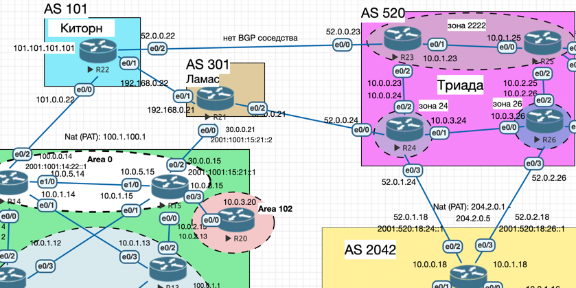
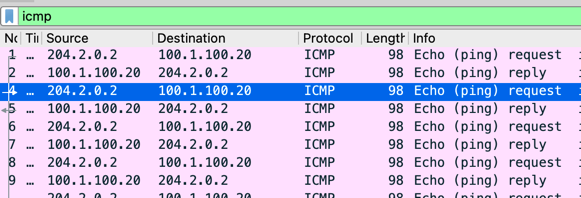

## Основные протоколы сети интернет. NAT. DHCP. NTP

### Цель:  
- Настроить NAT в офисе Москва, C.-Перетбруг и Чокурдах
- Настроить синхронизацию времени в офисе Москва
- Настроить DHCP в офисе Москва

#### Описание/Пошаговая инструкция выполнения домашнего задания:
В этой самостоятельной работе мы ожидаем, что вы самостоятельно:

- Настроите NAT(PAT) на R14 и R15. Трансляция должна осуществляться в адрес автономной системы AS1001.
- Настроите NAT(PAT) на R18. Трансляция должна осуществляться в пул из 5 адресов автономной системы AS2042.
- Настроите статический NAT для R20.
- Настроите NAT так, чтобы R19 был доступен с любого узла для удаленного управления. 
- *Настроите статический NAT(PAT) для офиса Чокурдах.
- Настроите для IPv4 DHCP сервер в офисе Москва на маршрутизаторах R12 и R13. VPC1 и VPC7 должны получать сетевые настройки по DHCP.
- Настроите NTP сервер на R12 и R13. Все устройства в офисе Москва должны синхронизировать время с R12 и R13.
- Все офисы в лабораторной работе должны иметь IP связность.

### Общая информация

<details>

<summary>Минимальная настройка</summary>

Для NAT(PAT)

```
ip nat pool NAT-POOL-MSK 100.1.100.1 100.1.100.1 netmask 255.255.255.252
access-list 1 permit 100.0.0.0 0.0.255.255
ip nat inside source list 1 pool NAT-POOL-MSK overload

interface Ethernet0/0
 ip nat inside

interface Ethernet0/2
 ip nat outside
```

</details>

<details>

<summary>Полезные команды</summary>

```
show ip nat translations 
show ip nat statistics
show ip nat translations verbose
```

```
show ip dhcp binding
ip dhcp -r
```
```
sh ntp status
sh ntp associations
```


</details>

<details>

<summary>Общая информация</summary>

- Статический NAT (**Static NAT**) – Трансляция локального
адреса в глобальный адрес
- Динамический NAT (**Dynamic NAT**) – Трансляция
нескольких адресов в несколько глобальных адресов
- Трансляция порта и IP адреса (**PAT**) – Сопоставление
адресов по схеме «многие к одному» между локальными
и глобальными адресами

Статический


Динамический


</details>


### Выполнение

### NAT в Москве (пограничные маршрутизаторы)

Спрячем внутреннюю сеть за IP `100.1.100.1`.
За этот IP пойдут пользовательские подсети:
- `100.0.0.0/24` (`100.0.0.10`)
- `100.0.1.0/24` (`100.0.1.7`)

NAT PAT – подойдет для большинства пользователей, которые деляют запросы в Интернет.

```
int Ethernet0/2
 ip address 100.1.100.1 255.255.255.252 secondary
exit

ip nat pool NAT-POOL-MSK 100.1.100.1 100.1.100.1 netmask 255.255.255.252

access-list 1 permit 100.0.0.0 0.0.255.255

ip nat inside source list 1 pool NAT-POOL-MSK overload

```

ключевое слово `overload` – указывает на использование PAT-трансляции.

```
int Ethernet0/2
 ip nat outside
 exit
int range Ethernet0/0-1
 ip nat inside
 exit 
int Ethernet0/3
 ip nat inside
 exit
```

Настройки в BGP:<br>
анонсируем сеть выделенную под NAT и убираем BGP анонсы для `100.0.0.0/24` и `100.0.1.0/24`

```
network 100.1.100.0 mask 255.255.255.252
```
```
R15> no network 100.0.1.0 mask 255.255.255.0
```
```
R14> no network 100.0.0.0 mask 255.255.255.0
```

Проверяем, что у пользователей не пропал доступ в Интернет (пинг из Москвы в Питер):

```
Executing the startup file

Checking for duplicate address...
PC1 : 100.0.0.10 255.255.255.0 gateway 100.0.0.1

PC1 : 2001:1001:0:100::10/64

VPCS> ping 200.0.0.8

84 bytes from 200.0.0.8 icmp_seq=1 ttl=56 time=2.623 ms
84 bytes from 200.0.0.8 icmp_seq=2 ttl=56 time=1.629 ms
84 bytes from 200.0.0.8 icmp_seq=3 ttl=56 time=1.546 ms
84 bytes from 200.0.0.8 icmp_seq=4 ttl=56 time=1.749 ms
```

Проверяем, что работает трансляция и вместо внутреннего source `100.0.0.10` подставляется внешний `100.1.100.1`:


### NAT в Санкт-Питербурге (пограничные маршрутизаторы)

Аналогично настроим NAT на R18. Отличие будет в том, что пул внешних адресов будет из 5 IP, а не одного.
Выделим внешние адреса: `204.2.0.1` – `204.2.0.5`

Определим списки пользовательских сетей: 
- 200.0.0.0/24
- 200.0.1.0/24

Конфигурация для R18:


```
ip route 204.2.0.0 255.255.255.248 Null0

access-list 1 permit 200.0.0.0 0.0.255.255

ip nat pool NAT-POOL-SPB 204.2.0.1 204.2.0.5 netmask 255.255.255.248
ip nat inside source list 1 pool NAT-POOL-SPB overload
!

!
interface Ethernet0/0
 ip nat inside
!
interface Ethernet0/1
 ip nat inside
!
interface Ethernet0/2
 ip nat outside
!
interface Ethernet0/3
 ip nat outside
!

```

```
no network 200.0.0.0
no network 200.0.1.0
network 204.2.0.0 mask 255.255.255.248
```

### Тест

```
VPCS> show

NAME   IP/MASK              GATEWAY                             GATEWAY
VPCS1  200.0.0.8/24         200.0.0.1
       fe80::250:79ff:fe66:6808/64
       2001:2042:8:9::1/64

VPCS> ping 101.101.101.101 -t

84 bytes from 101.101.101.101 icmp_seq=1 ttl=250 time=1.081 ms
84 bytes from 101.101.101.101 icmp_seq=2 ttl=250 time=1.160 ms
84 bytes from 101.101.101.101 icmp_seq=3 ttl=250 time=1.100 ms
84 bytes from 101.101.101.101 icmp_seq=4 ttl=250 time=1.105 ms
84 bytes from 101.101.101.101 icmp_seq=5 ttl=250 time=1.145 ms
84 bytes from 101.101.101.101 icmp_seq=6 ttl=250 time=1.129 ms
84 bytes from 101.101.101.101 icmp_seq=7 ttl=250 time=1.139 ms
```

Заметим, что работает BGP балансировка и ICMP запросы идут по линку R18-R24, а ответы по R18-R26




#### Static NAT для R20 (Москва)

R15:
```
ip nat inside source static 10.0.3.20 100.1.100.20
```



Содержимое NAT таблицы (`show ip nat translations`):

```
R15#show ip nat translations
Pro Inside global      Inside local       Outside local      Outside global
icmp 100.1.100.20:45075 10.0.3.20:45075   204.2.0.2:45075    204.2.0.2:45075
icmp 100.1.100.20:45331 10.0.3.20:45331   204.2.0.2:45331    204.2.0.2:45331
icmp 100.1.100.20:45587 10.0.3.20:45587   204.2.0.2:45587    204.2.0.2:45587
icmp 100.1.100.20:45843 10.0.3.20:45843   204.2.0.2:45843    204.2.0.2:45843
icmp 100.1.100.20:46099 10.0.3.20:46099   204.2.0.2:46099    204.2.0.2:46099
icmp 100.1.100.20:46355 10.0.3.20:46355   204.2.0.2:46355    204.2.0.2:46355
icmp 100.1.100.20:46611 10.0.3.20:46611   204.2.0.2:46611    204.2.0.2:46611
icmp 100.1.100.20:46867 10.0.3.20:46867   204.2.0.2:46867    204.2.0.2:46867
icmp 100.1.100.20:47123 10.0.3.20:47123   204.2.0.2:47123    204.2.0.2:47123
icmp 100.1.100.20:47379 10.0.3.20:47379   204.2.0.2:47379    204.2.0.2:47379
icmp 100.1.100.20:47635 10.0.3.20:47635   204.2.0.2:47635    204.2.0.2:47635
icmp 100.1.100.20:47891 10.0.3.20:47891   204.2.0.2:47891    204.2.0.2:47891
icmp 100.1.100.20:48147 10.0.3.20:48147   204.2.0.2:48147    204.2.0.2:48147
```


#### R19 доступен с любого узла для удаленного управления (Москва)

Настроим на R19 `telnet`, к которому будем подключаться для управления:

```
configure terminal
line vty 0 4
transport input telnet 
password sex
login
```

В целях безопасности сделаем переопределение портов 23 -> 2023, для этого используем ключевое слово `extendable`

R15:
```
ip nat inside source static tcp 10.0.4.19 23 100.1.100.19 2023 extendable
```

Проверка:

```
VPCS> ping 100.1.100.19 -3 -p 2023

Connect   2023@100.1.100.19 seq=1 ttl=248 time=2.145 ms
SendData  2023@100.1.100.19 seq=1 ttl=248 time=1.071 ms
Close     2023@100.1.100.19 timeout(10.598ms)
Connect   2023@100.1.100.19 seq=2 ttl=248 time=5.359 ms
SendData  2023@100.1.100.19 seq=2 ttl=248 time=1.073 ms
Close     2023@100.1.100.19 timeout(10.580ms)
Connect   2023@100.1.100.19 seq=3 ttl=248 time=4.260 ms
SendData  2023@100.1.100.19 seq=3 ttl=248 time=1.038 ms
Close     2023@100.1.100.19 timeout(6.384ms)
Connect   2023@100.1.100.19 seq=4 ttl=248 time=4.282 ms
SendData  2023@100.1.100.19 seq=4 ttl=248 time=1.064 ms
Close     2023@100.1.100.19 timeout(9.508ms)
Connect   2023@100.1.100.19 seq=5 ttl=248 time=4.283 ms
SendData  2023@100.1.100.19 seq=5 ttl=248 time=1.064 ms
Close     2023@100.1.100.19 timeout(10.235ms)
```
Вид через wireshark:


Таблица трансляции на R15:

```
R15#show ip nat translations
Pro Inside global      Inside local       Outside local      Outside global
--- 100.1.100.20       10.0.3.20          ---                ---
tcp 100.1.100.19:2023  10.0.4.19:23       204.2.0.2:35997    204.2.0.2:35997
tcp 100.1.100.19:2023  10.0.4.19:23       ---                ---
```

### Настроить DHCPv4 сервера на R12 и R13, VPC1 и VPC7 должны получать адреса по DHCP.

Настроим DHCP на R12, R13.

На R12 выделим пулы адресов `100.0.0.1 - 100.0.0.127` и `100.0.1.1 - 100.0.1.127`:

```
conf t
!
ip dhcp excluded-address 100.0.0.1 100.0.0.5
ip dhcp excluded-address 100.0.0.128 100.0.0.255

ip dhcp excluded-address 100.0.1.1 100.0.1.5
ip dhcp excluded-address 100.0.1.128 100.0.1.255

!
ip dhcp pool LAN-1
 network 100.0.0.0 255.255.255.0
 default-router 100.0.0.1
 domain-name kolxoz.net
!
ip dhcp pool LAN-2
 network 100.0.1.0 255.255.255.0
 default-router 100.0.1.1
 domain-name kolxoz.net
 exit
exit 
```

На R13 выделим пул адресов `100.0.0.128-100.0.0.255` и `100.0.1.128-100.0.1.255`:

```
conf t
!
ip dhcp excluded-address 100.0.0.1 100.0.0.127
ip dhcp excluded-address 100.0.1.1 100.0.1.127

!
ip dhcp pool LAN-1
 network 100.0.0.0 255.255.255.0
 default-router 100.0.0.1
 domain-name kolxoz.net
!
ip dhcp pool LAN-2
 network 100.0.1.0 255.255.255.0
 default-router 100.0.1.1
 domain-name kolxoz.net
 exit
exit 
```

### Проверка:

Обновляем IP с VPC:
```
Executing the startup file

Checking for duplicate address...
PC1 : 100.0.0.10 255.255.255.0 gateway 100.0.0.1

PC1 : 2001:1001:0:100::10/64
```
```
VPCS> ip dhcp -r
DDORA IP 100.0.0.128/24 GW 100.0.0.1
```
```
VPCS> show

NAME   IP/MASK              GATEWAY                             GATEWAY
VPCS1  100.0.0.128/24       100.0.0.1
       fe80::250:79ff:fe66:6801/64
       2001:1001:0:100::10/64
```

Оба DHCP-сервера выдали IP-адреса:
```
R12#show ip dhcp binding
Bindings from all pools not associated with VRF:
IP address          Client-ID/	 	    Lease expiration        Type
		    Hardware address/
		    User name
100.0.0.6           0100.5079.6668.01       Jul 30 2022 02:39 AM    Automatic
R12#
```

```
R13#show ip dhcp binding
Bindings from all pools not associated with VRF:
IP address          Client-ID/	 	    Lease expiration        Type
		    Hardware address/
		    User name
100.0.0.128         0100.5079.6668.01       Aug 01 2022 02:39 AM    Automatic
```

Как видно выше используется IP-адрес `100.0.0.128`, полученный с R13. 


### Настроить NTP сервера

Настроим R12, R13 в роли мастеров (т.к. доступа к Интернету – нет).
После ключевого слова `master` указывается точность часов от 0 (высокая точность) до 15 (низкая точность).

Сервера R12, R13:
```
conf t
!
ntp master 2
exit
!
```

Клиенты роутеры:
```
conf t
!
ntp server 100.0.0.1
ntp server 100.0.1.1
!
ntp update-calendar
!
```

Клиенты коммутаторы:
```
conf t
!
ntp server 172.16.0.12
ntp server 172.16.0.13
ntp update-calendar
exit
!
```

Проверка:
```
R12#sh ntp status
Clock is synchronized, stratum 2, reference is 127.127.1.1
nominal freq is 250.0000 Hz, actual freq is 250.0000 Hz, precision is 2**10
ntp uptime is 150800 (1/100 of seconds), resolution is 4000
reference time is E68F02BB.D3B647E8 (03:07:07.827 EET Sat Jul 30 2022)
clock offset is 0.0000 msec, root delay is 0.00 msec
root dispersion is 2.22 msec, peer dispersion is 1.20 msec
loopfilter state is 'CTRL' (Normal Controlled Loop), drift is 0.000000000 s/s
system poll interval is 16, last update was 4 sec ago.
```
```
R12#sh ntp associations

  address         ref clock       st   when   poll reach  delay  offset   disp
*~127.127.1.1     .LOCL.           1     12     16   377  0.000   0.000  1.204
 * sys.peer, # selected, + candidate, - outlyer, x falseticker, ~ configured
```

```
SW4#sh ntp associations

  address         ref clock       st   when   poll reach  delay  offset   disp
*~172.16.0.12     127.127.1.1      2     11     64   377  0.000   0.000  2.908
+~172.16.0.13     127.127.1.1      2     15     64     1  1.000  -0.500 189.44
 * sys.peer, # selected, + candidate, - outlyer, x falseticker, ~ configured
```
